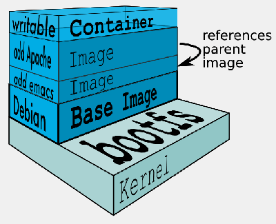
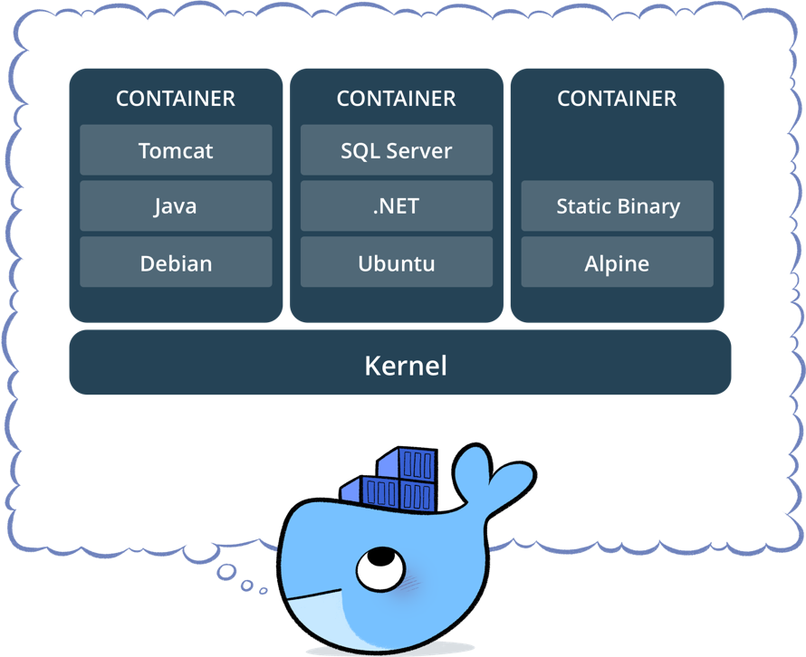

docker workshop - about
===============

this is a slide deck for an introductory docker workshop:

* slides: <http://tmstff.github.io/docker-workshop>
* source: <https://github.com/tmstff/docker-workshop>
* original slides by Sebastian Mancke: <https://github.com/smancke/docker-intro>

to run locally use any of these: <https://gist.github.com/willurd/5720255>

e.g.

```
$ python -m SimpleHTTPServer 8000
```


docker workshop - contents
===============

contents:
----------
1. __intro__
1. __docker command__
1. __docker-compose command__
1. __docker-compose at rewe__
1. __create docker images__

intro: images & containers
================

container
----------------
* a linux process with isolated execution environment
* sandbox with defined resources (e.g. file system)
* uses kernel from underlying OS (not a virtualization)
* based on an image (see below)

intro: images & containers
================

image
--------------------
* template for containers
* file system diff to parent image
* immutable
* can be pulled from / pushed to a registry (default: <https://hub.docker.com/>)



intro: images & containers
================



intro: tools
===============

docker
--------------------
* manage images & containers (create, start, list etc.)
* installation instructions: <https://docs.docker.com/installation/>
* installation in Ubuntu and Debian: `curl https://get.docker.com/ | sh`

docker-compose
--------------------
* tool for defining and running multi-container Docker applications
* installation instructions: <https://docs.docker.com/compose/install/>

docker-machine
--------------------
* run docker engine on virtual and/or remote hostname
* installation instructions: <https://docs.docker.com/machine/install-machine/>

intro: tools
===============

docker swarm
--------------------
* native clustering for Docker
* turns a pool of Docker hosts into a single, virtual Docker host
* in Docker 1.12 and higher, Swarm mode is integrated with Docker Engine: <https://docs.docker.com/engine/swarm/>

docker - hello world!
=========================

    docker run busybox echo 'Hello World'

What has happened?

* Download the image `busybox`
* Create a new container
* Execute the `echo` command within the new container


docker - commands for image handling
==============================

search, pull & push
----------------------

searching in the registry:

    docker search <term>

download or update an image from the registry:

    docker pull <image>

upload an image to the registry:

    docker push <image>

docker - commands for image handling
==============================

list, tag & delete
----------------------

listing of downloaded images:

    docker images

give an image a new name (alias):

    docker tag <oldname> <newname>

delete an image locally:

    docker rmi <image>

docker run
===============

Start a new container

    docker run <imagename>

Some run options:

    Usage: docker run [OPTIONS] IMAGE [COMMAND] [ARG...]
     --name             Give the container a symbolic name
     -v, --volume=[]    Bind mount a volume
     -p, --publish=[]   Publish a container's port(s) to the host
     -e, --env=[]       Set environment variables
     --rm=false         Automatically remove the container when it exits
     -d, --detach=false Run container in background and print container ID
     -i, --interactive=false   Keep STDIN open even if not attached
     -t, --tty=false    Allocate a pseudo-TTY

Exercise:
----------
Start an nginx web server with a custom `index.html` file.

docker ps
========================

List containers
-----------------
The running containers:

    docker ps

All containers:

    docker ps -a


docker - container livecycle
=========================

Stop running containers:

    docker stop <container..>

Start stopped containers:

    docker start <container..>

Kill running containers:

    docker kill <container..>

Remove containers:

    docker rm <container..>


docker - useful tricks: container id
==============================

give your containers a name

    docker run --name my_webserver nginx
    docker rm -f my_webserver

save the container id in shell variables

    c=$(docker run -d nginx)
    docker rm -f $c

start containers in foreground and with `--rm`, when playing arround:

    docker run --rm nginx


docker - interaction and debugging
==========================

exec
-----

Run a command in an existing container, e.g start a shell

    docker exec <container> <command>
    docker exec -it <container> bash

logs
--------
See the logs (stdout) of the container.

    docker logs -f <container>

copy
-------
copy files from and to docker container, e.g.

    docker cp my_webserver:/etc/nginx/nginx.conf ~/

docker - interaction and debugging
==========================

Exercise
----------
1. Start a webserver
2. Overwrite the content of the index.html (in the running container)
3. Watch the webserver logs
4. compare the output of `ps aux` from your container with the host

docker - useful tricks: cleanup script
=======================================
You have to cleanup your local images and old containers regulary.

    docker rm $(docker ps -q -a -f status=exited)
    docker rmi $(docker images -q -f dangling=true)

Especially on test and build systems this should be part of a cron job.

    exited=$(docker ps -q -a -f status=exited | wc -l)

    if [ "$exited" != "0" ]; then
            docker rm $(docker ps -q -a -f status=exited)
    fi

    tagref=$(docker images -q -f dangling=true | wc -l)

    if [ "$tagref" != "0" ]; then0
            docker rmi $(docker images -q -f dangling=true)
    fi

docker-compose
================
docker-compose is a simple tool to start multiple containers.

Configuration by `docker-compose.yml`:

    version: '2'
    services:
      web:
        build: .
        ports:
          - "5000:5000"
        volumes:
          - .:/code
        links:
          - "redis"

      redis:
        image: redis


docker-compose usage
=====================
    Usage:
      docker-compose [options] [COMMAND] [ARGS...]
      docker-compose -h|--help

    Commands: (selection)
      up                 Create and start containers
      down               Stop and remove containers, networks, images, and volumes
      build              Build or rebuild services
      logs               View output from containers
      ps                 List containers
      pull               Pull service images
      rm                 Remove stopped containers
      start              Start services
      stop               Stop services
      .. there are some more ..

docker-compose Exercise
===================
1. Setup a docker-compose project with:
   - webserver with php
   - database of choice (e.g. mysql, postgres, or nosql, ...)
2. Implement a counter example im php


docker-compose at rewe
===================

real-world-example rewe-article-connector


create docker images
=====================

The normal way to create images is through `Dockerfile` build descriptions.

1. create a `Dockerfile`, e.g.

        FROM nginx
        COPY index.html /usr/share/nginx/html/

2. build the image an give it a name

        docker build --pull -t my-nginx .


Note:
---------------------
- The build has the current directory as context
- All paths are relative to the Dockerfile
- Each command in the Dockerfile creates a new (temporary container)
- Every creation steps is cached, so repeated builds are fast


create docker images - Dockerfile
=====================

FROM
--------

The `FROM` instruction sets the Base Image:

    FROM <image>:<tag>

Example:

    FROM nginx:15:04

create docker images - Dockerfile
=====================

COPY
--------
`COPY` can be used to copy files or directories to the image.

    COPY <src>... <dest>

- Source can contain wildcards
- If dest does not exist it will be created

Example:

    COPY service.config /etc/service/
    COPY service.config /etc/service/myconfig.cfg
    COPY *.config /etc/service/
    COPY cfg/ /etc/service/

create docker images - Dockerfile
=====================

Exercise
----------

Recreate your webserver image with static content using `docker build`

create docker images - Dockerfile
=====================

CMD
--------

With `CMD` you can specify the default command to execute on container startup.
It has who forms.

The exec form (preferred):

    CMD ["executable","param1","param2"]

The shell form:

    CMD executable param1 param2

__Attention__: the shell form starts the command in a sub process, so it will not get
the process id 1 and will not receive all signals e.g. from command line or `docker stop`.

Example:

    CMD ["nginx", "-g", "daemon off;"]

create docker images - Dockerfile
=====================

ENTRYPOINT
-----------

The command in `ENTRYPOINT` will be executed on startup and allows you to configure a container that will run as an executable.

- The arguments in `CMD` are passed to the entrypoint by default
- If supplied, the `docker run` arguments overwrite those of the `CMD` and are passed as entrypoints arguments.

The exec form (preferred):

    ENTRYPOINT ["executable", "param1", "param2"]

Example:

    ENTRYPOINT ["top", "-b"]
    CMD ["-c"]

create docker images - Dockerfile
=====================

RUN
--------

The `RUN` command allows to execute commands arbitary commands in the container, which modify the
file system and produce a new layered container.

    RUN <command>

It is common to tie related commands together into one RUN command, using shell magic.

Example:

    RUN apt-get update && \
        apt-get install -y ca-certificates nginx=${NGINX_VERSION} && \
        rm -rf /var/lib/apt/lists/*

create docker images - Dockerfile
=====================

ENV
------------------------
`ENV` sets environment variables which are present during container build and remain existent in the image.

    ENV <key> <value>
    ENV <key>=<value> ...

On container startup they can be overwritten with the `-e` or `--env` option:

    docker run -e key=value my_image

Example:

    docker run -e message='The answer is' -e answer=42 \
        ubuntu \
        bash -c 'echo $message $answer'
    The answer is 42

create docker images - Dockerfile
==========================

Exercise
----------
Create a `greeting` image which can echo a configurable hello world greeting message in ascii art (e.g. using the ubuntu package figlet):

    docker run --rm greeting
    >  _   _       _ _         __  __                  _
    > | | | | __ _| | | ___   |  \/  | __ _ _ ____   _(_)_ __
    > | |_| |/ _` | | |/ _ \  | |\/| |/ _` | '__\ \ / / | '_ \
    > |  _  | (_| | | | (_) | | |  | | (_| | |   \ V /| | | | |
    > |_| |_|\__,_|_|_|\___/  |_|  |_|\__,_|_|    \_/ |_|_| |_|

    docker run --rm -e message=Hi greeting Arthur
    >  _   _ _      _         _   _
    > | | | (_)    / \   _ __| |_| |__  _   _ _ __
    > | |_| | |   / _ \ | '__| __| '_ \| | | | '__|
    > |  _  | |  / ___ \| |  | |_| | | | |_| | |
    > |_| |_|_| /_/   \_\_|   \__|_| |_|\__,_|_|


create docker images - Dockerfile
=====================

ADD
--------
`ADD` can do the same as `COPY` with the following additions:

- If src is an URL, the file is downloaded
- If src is a local tar archive, it will be extracted to dest

Example:

    ADD https://download.elasticsearch.org/elasticsearch/elasticsearch/elasticsearch-1.4.4.tar.gz /es/
    RUN cd /es && tar xvfz elasticsearch-1.4.4.tar.gz

    ADD configs.tar.gz /etc/service/

create docker images - Dockerfile
=====================

VOLUME
------------------------
Declare folders for volume mounts.

    VOLUME ["/data"]

Benefit:
-------
- The user of your image has explicit documentation of the available mounts
- The docker deamon and cloud tools can persist and backup them
- You can use the volumes from other containers by

        docker run --volumes-from container_with_volumes

create docker images - Dockerfile
=====================

EXPOSE
------------------------
With `EXPOSE` an image can declare the ports which should be exported.

    EXPOSE <port> [<port>...]

Benefit:
-------
- This information is needed for communication between linked containers
- The exposed ports can be uses by the `docker run -P`:

        -P, --publish-all=false  Publish all exposed ports to random ports


create docker images - Example nginx
=================
    FROM debian:jessie

    MAINTAINER NGINX Docker Maintainers "docker-maint@nginx.com"

    RUN apt-key adv --keyserver hkp://pgp.mit.edu:80 --recv-keys 573BFD6B3D8FBC641079A6ABABF5BD827BD9BF62
    RUN echo "deb http://nginx.org/packages/mainline/debian/ jessie nginx" >> /etc/apt/sources.list

    ENV NGINX_VERSION 1.9.3-1~jessie

    RUN apt-get update && \
        apt-get install -y ca-certificates nginx=${NGINX_VERSION} && \
        rm -rf /var/lib/apt/lists/*

    # forward request and error logs to docker log collector
    RUN ln -sf /dev/stdout /var/log/nginx/access.log
    RUN ln -sf /dev/stderr /var/log/nginx/error.log

    VOLUME ["/var/cache/nginx"]

    EXPOSE 80 443

    CMD ["nginx", "-g", "daemon off;"]
